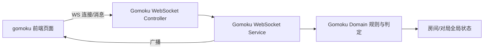
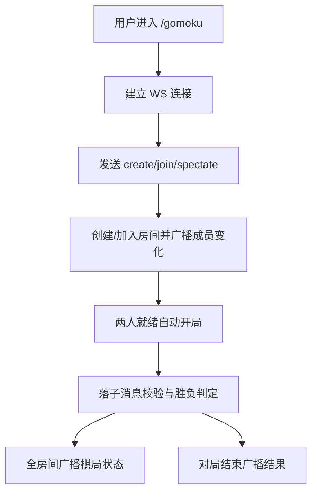

## Product Overview

新增独立的在线五子棋对战页面与 WebSocket 对战接口，支持房间号邀请、两人满员自动开局与观战加入。

## Core Features

- 创建/加入房间与房间号邀请
- 房间满 2 人自动开局与观战进入
- 15x15 棋盘对弈、五连胜判定、无禁手
- 对局状态与结果提示的实时同步

## Tech Stack

- 语言与框架：Rust（hyperlane 框架）
- 通信协议：WebSocket
- 前端：独立静态页面（HTML/CSS/JS）
- OpenAPI：utoipa 现有聚合

## Tech Architecture

### System Architecture

- 复用现有控制器/服务/领域层组织方式，新增 gomoku 模块与全局房间状态管理
- 只新增路由与静态资源目录，不改现有路由行为



### Module Division

- **controller::gomoku**：WebSocket 入口、参数解析、连接生命周期处理
- **service::gomoku_websocket**：消息解析、路由分发、广播策略
- **domain::gomoku**：房间管理、落子校验、胜负判定、观战同步
- **mapper::gomoku::static**：房间列表与连接映射的全局状态
- **view::gomoku**：新增 `/gomoku` 路由跳转至静态页面
- **resources/static/gomoku/**：页面与静态资源目录

### Data Flow



## Implementation Details

### Core Directory Structure

```
d:/code/hyperlane-quick-start/
├── app/
│   ├── controller/gomoku/        # 新增：WS 路由与处理
│   ├── service/gomoku_websocket/ # 新增：消息分发与广播
│   ├── domain/gomoku/            # 新增：规则/房间/判定
│   ├── mapper/gomoku/static.rs   # 新增：全局房间状态
│   └── view/gomoku/              # 新增：/gomoku 视图路由
├── resources/static/gomoku/      # 新增：页面与资源
└── app/mapper/openapi/struct.rs  # 更新：OpenAPI 聚合
```

### Key Code Structures

**房间状态结构**

```rust
struct GomokuRoom {
  room_id: String,
  owner_id: String,
  players: [Option<String>; 2],
  spectators: Vec<String>,
  board: [[u8; 15]; 15],
  next_turn: u8,
  status: GameStatus,
}
```

**WebSocket 消息结构**

```rust
enum GomokuMessageType { CreateRoom, JoinRoom, Spectate, PlaceStone, Leave, Sync }
struct GomokuMessage { msg_type: GomokuMessageType, room_id: String, payload: serde_json::Value }
```

## Technical Implementation Plan

### 房间与对局状态管理

- **Problem**：支持多房间、观战与对局状态同步
- **Approach**：全局并发安全房间 Map + 每房间状态对象
- **Technologies**：OnceLock + Arc<RwLock<HashMap<...>>>
- **Steps**：定义房间结构 → 全局状态读写 API → 连接加入/离开同步
- **Testing**：单房间并发加入/离开与观战回放验证

### 落子与胜负判定

- **Problem**：15x15、五连胜、无禁手的胜负判断
- **Approach**：落子后四方向连续计数
- **Technologies**：domain 模块纯逻辑
- **Steps**：落子校验 → 方向扫描 → 触发胜负与广播
- **Testing**：横/竖/斜/反斜胜局测试用例

### WebSocket 消息协议

- **Problem**：统一房间指令与状态回传
- **Approach**：消息类型枚举 + payload
- **Technologies**：serde/serde_json
- **Steps**：定义消息协议 → service 路由分发 → domain 执行 → 广播
- **Testing**：Create/Join/Place/Spectate 全链路模拟

### Integration Points

- 视图：新增 `/gomoku` 路由指向 `/static/gomoku/index.html`
- 静态资源：复用 `StaticResourceRoute` 的 `/static/*` 目录
- OpenAPI：在 `app/mapper/openapi/struct.rs` 聚合新 view/WS 路由

## Design Style

以现代科技感与清晰对弈体验为核心，采用玻璃拟态+柔和渐变背景，突出棋盘与状态信息，交互具备悬停与落子微动效。页面为桌面端布局，强调房间与观战信息的可读性与层级感。

## Page Planning

- **对战主页面（/gomoku）**

### Page Blocks

1. **顶部导航栏**：左侧项目与页面标题，右侧显示当前房间号与连接状态徽标。
2. **房间控制区**：创建/加入/观战输入与按钮区，展示玩家与观战人数。
3. **棋盘主区域**：15x15 网格棋盘，支持落子高亮与最近一步标识。
4. **对局信息侧栏**：显示当前回合、步数、结果提示与历史落子列表。
5. **底部导航栏**：帮助入口、规则说明与版权信息。

## Agent Extensions

### SubAgent

- **code-explorer**
- Purpose: 扫描现有 WebSocket/Chat 相关模块与路由注册模式
- Expected outcome: 明确 gomoku 模块应复用的结构与修改入口