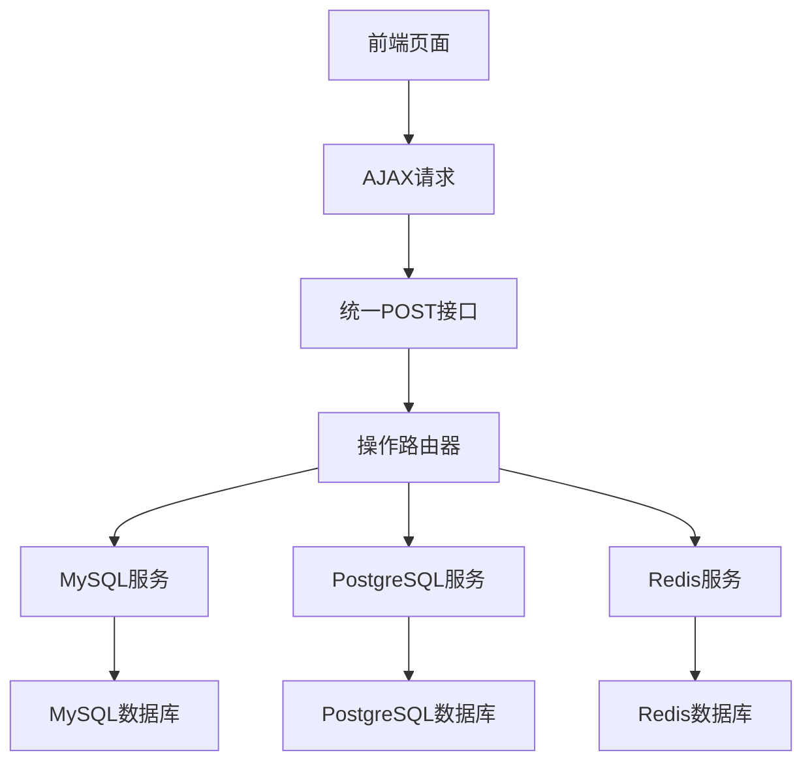

# 设计文档

## 概述

本设计文档描述了如何重构MySQL、PostgreSQL和Redis数据库接口，将所有HTTP方法统一改为POST，并将前端从HTMX表单提交改为纯AJAX请求。设计目标是提高API一致性、简化客户端调用逻辑，并增强前端交互的灵活性。

## 架构

### 当前架构问题分析

1. **HTTP方法不一致**：当前代码中存在路径与HTTP方法不匹配的问题（如GET方法用于delete路径）
2. **前端依赖HTMX**：使用HTMX进行表单提交，限制了前端的灵活性
3. **API设计不统一**：不同操作使用不同的HTTP方法，增加了客户端复杂性

### 目标架构



## 组件和接口

### 1. 统一请求格式

所有数据库操作将使用统一的POST请求格式：

```rust
#[derive(Debug, Clone, Serialize, Deserialize, ToSchema)]
pub struct DatabaseOperation<T> {
    pub operation: OperationType,
    pub data: Option<T>,
    pub key: Option<String>,
    pub keys: Option<Vec<String>>, // 仅用于Redis批量查询
}

#[derive(Debug, Clone, Serialize, Deserialize, ToSchema)]
pub enum OperationType {
    Create,
    Read,
    Update,
    Delete,
}
```

### 2. 统一响应格式

```rust
#[derive(Debug, Clone, Serialize, Deserialize, ToSchema)]
pub struct ApiResponse<T> {
    pub success: bool,
    pub message: String,
    pub data: Option<T>,
}
```

### 3. 重构后的路由结构

#### MySQL接口
- `POST /api/mysql` - 统一处理所有MySQL操作

#### PostgreSQL接口
- `POST /api/postgresql` - 统一处理所有PostgreSQL操作

#### Redis接口
- `POST /api/redis` - 统一处理所有Redis操作

### 4. 控制器层重构

每个数据库控制器将包含一个统一的处理函数：

```rust
#[route("/api/mysql")]
#[prologue_macros(post, request_body_json(operation: DatabaseOperation<MysqlRecord>))]
pub async fn handle_mysql_operation(ctx: Context) {
    // 根据operation.operation字段分发到不同的服务函数
}
```

### 5. 前端AJAX实现

使用原生JavaScript fetch API替代HTMX：

```javascript
async function performDatabaseOperation(database, operation, data = null, key = null) {
    const requestBody = {
        operation: operation,
        data: data,
        key: key
    };
    
    const response = await fetch(`/api/${database}`, {
        method: 'POST',
        headers: {
            'Content-Type': 'application/json',
        },
        body: JSON.stringify(requestBody)
    });
    
    return await response.json();
}
```

## 数据模型

### 现有数据模型保持不变

- `MysqlRecord`: `{ key: String, value: String }`
- `PostgresqlRecord`: `{ key: String, value: String }`
- `RedisRecord`: `{ key: String, value: String }`

### 新增操作模型

```rust
// 通用操作请求
pub struct DatabaseOperation<T> {
    pub operation: OperationType,
    pub data: Option<T>,
    pub key: Option<String>,
    pub keys: Option<Vec<String>>,
}

// 通用API响应
pub struct ApiResponse<T> {
    pub success: bool,
    pub message: String,
    pub data: Option<T>,
}
```

## 错误处理

### 统一错误响应格式

所有API错误将返回统一格式：

```json
{
    "success": false,
    "message": "具体错误信息",
    "data": null
}
```

### 前端错误处理

```javascript
async function handleApiResponse(response) {
    if (!response.success) {
        showErrorMessage(response.message);
        return null;
    }
    return response.data;
}
```

## 测试策略

### 1. 单元测试
- 测试每个数据库服务函数的CRUD操作
- 测试统一操作分发逻辑
- 测试错误处理机制

### 2. 集成测试
- 测试完整的API请求-响应流程
- 测试不同操作类型的正确分发
- 测试错误场景的处理

### 3. 前端测试
- 测试AJAX请求的正确发送
- 测试响应数据的正确处理
- 测试用户界面的动态更新

## 实施计划

### 阶段1：后端重构
1. 创建统一的数据模型（DatabaseOperation, ApiResponse）
2. 重构控制器层，实现统一的POST接口
3. 更新路由配置
4. 更新OpenAPI文档

### 阶段2：前端重构
1. 移除HTMX依赖
2. 实现统一的AJAX请求函数
3. 更新所有表单提交逻辑
4. 实现错误处理和用户反馈

### 阶段3：测试和优化
1. 编写和执行测试用例
2. 性能优化
3. 文档更新

## 兼容性考虑

- 保持现有的数据库连接和服务层逻辑不变
- 确保数据格式向后兼容
- 提供平滑的迁移路径

## 安全考虑

- 验证所有输入数据
- 实施适当的错误处理，避免信息泄露
- 保持现有的数据库连接安全机制