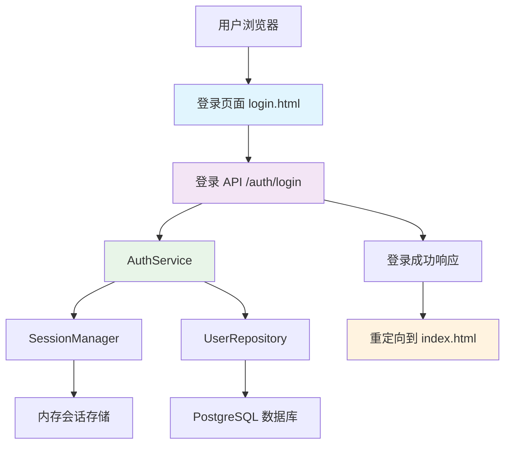
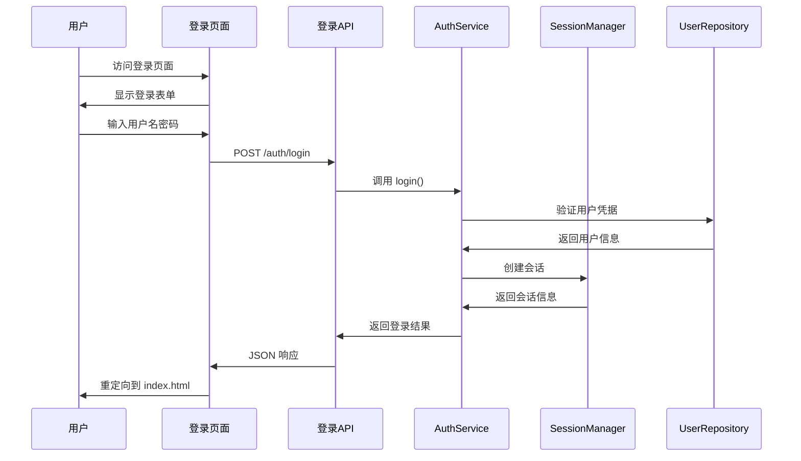

# 登录页面功能设计文档

## 概述

本设计文档描述了为现有 Rust Web 应用程序添加登录功能的技术实现方案。系统将在现有的认证服务基础上，添加登录 API 路由和现代化的前端登录页面，实现完整的用户身份验证流程。

## 架构

### 系统架构图



### 请求流程



## 组件和接口

### 1. 后端组件

#### 1.1 登录数据传输对象

需要创建以下数据结构：

```rust
// 登录请求
#[derive(Debug, Serialize, Deserialize)]
pub struct LoginRequest {
    pub username: String,
    pub password: String,
}

// 登录响应
#[derive(Debug, Serialize, Deserialize)]
pub struct LoginResponse {
    pub success: bool,
    pub message: String,
    pub user_id: Option<i64>,
    pub username: Option<String>,
    pub session_id: Option<String>,
    pub expires_at: Option<DateTime<Utc>>,
}
```

#### 1.2 登录路由处理器

在 `app/controller/auth/routes.rs` 中添加：

```rust
#[route("/auth/login")]
#[prologue_hooks(
    post,
    response_header(CONTENT_TYPE => APPLICATION_JSON)
)]
pub async fn login(ctx: Context) {
    let response = handle_login(&ctx).await;
    let response_json = serde_json::to_vec(&response).unwrap_or_default();
    ctx.set_response_body(&response_json).await;
}
```

#### 1.3 静态文件路由

需要添加静态文件服务路由，确保可以访问 HTML、CSS、JS 文件：

```rust
#[route("/login")]
#[prologue_hooks(get)]
pub async fn serve_login_page(ctx: Context) {
    // 服务登录页面
}

#[route("/")]
#[prologue_hooks(get)]
pub async fn serve_index_page(ctx: Context) {
    // 服务主页面
}
```

### 2. 前端组件

#### 2.1 登录页面结构

创建 `resources/static/html/login.html`，包含：

- 现代化的响应式设计，与现有监控页面风格一致
- 用户名和密码输入框
- 登录按钮和加载状态
- 错误消息显示区域
- 客户端表单验证

#### 2.2 样式设计

采用与 `monitor.html` 相同的设计语言：
- 深色渐变背景
- 玻璃态效果卡片
- 蓝绿色主题色彩
- 平滑的动画过渡

#### 2.3 JavaScript 功能

- 表单提交处理
- AJAX 登录请求
- 错误处理和显示
- 成功后重定向
- 输入验证

## 数据模型

### 登录请求模型

```json
{
  "username": "string",
  "password": "string"
}
```

### 登录响应模型

成功响应：
```json
{
  "success": true,
  "message": "Login successful",
  "user_id": 123,
  "username": "john_doe",
  "session_id": "uuid-session-id",
  "expires_at": "2024-01-01T12:00:00Z"
}
```

失败响应：
```json
{
  "success": false,
  "message": "Invalid credentials",
  "user_id": null,
  "username": null,
  "session_id": null,
  "expires_at": null
}
```

## 错误处理

### 1. 后端错误处理

- **400 Bad Request**: 请求格式无效
- **401 Unauthorized**: 用户名或密码错误
- **500 Internal Server Error**: 服务器内部错误
- **503 Service Unavailable**: 认证服务不可用

### 2. 前端错误处理

- 网络连接错误
- 服务器响应错误
- 表单验证错误
- 会话过期处理

### 3. 错误消息映射

```javascript
const ERROR_MESSAGES = {
  'network_error': '网络连接失败，请检查网络连接',
  'invalid_credentials': '用户名或密码错误',
  'server_error': '服务器内部错误，请稍后重试',
  'service_unavailable': '认证服务暂时不可用',
  'validation_error': '请填写完整的登录信息'
};
```

## 测试策略

### 1. 单元测试

- 登录请求验证测试
- 认证服务集成测试
- 会话管理测试
- 错误处理测试

### 2. 集成测试

- 完整登录流程测试
- API 端点测试
- 会话创建和验证测试
- 重定向功能测试

### 3. 前端测试

- 表单提交测试
- 错误显示测试
- 响应式设计测试
- 浏览器兼容性测试

### 4. 安全测试

- SQL 注入防护测试
- XSS 攻击防护测试
- CSRF 防护测试
- 密码强度验证测试

## 安全考虑

### 1. 密码安全

- 使用现有的密码哈希机制（bcrypt）
- 不在日志中记录敏感信息
- 实施密码复杂度要求

### 2. 会话安全

- 使用安全的会话 ID 生成
- 实施会话超时机制
- 支持会话失效和清理

### 3. 传输安全

- 强制使用 HTTPS（生产环境）
- 实施 CSRF 保护
- 设置安全的 HTTP 头

### 4. 输入验证

- 前端和后端双重验证
- 防止 SQL 注入
- 输入长度限制

## 性能考虑

### 1. 前端性能

- 最小化 CSS 和 JavaScript
- 使用 CDN 加载外部资源
- 实施缓存策略

### 2. 后端性能

- 数据库查询优化
- 会话存储优化
- 响应时间监控

### 3. 缓存策略

- 静态资源缓存
- API 响应缓存（适当情况下）
- 浏览器缓存控制

## 部署考虑

### 1. 静态文件服务

- 确保静态文件路由正确配置
- 设置适当的 MIME 类型
- 配置文件压缩

### 2. 环境配置

- 开发环境和生产环境的差异化配置
- 数据库连接配置
- 会话超时配置

### 3. 监控和日志

- 登录成功/失败日志
- 性能监控
- 错误追踪