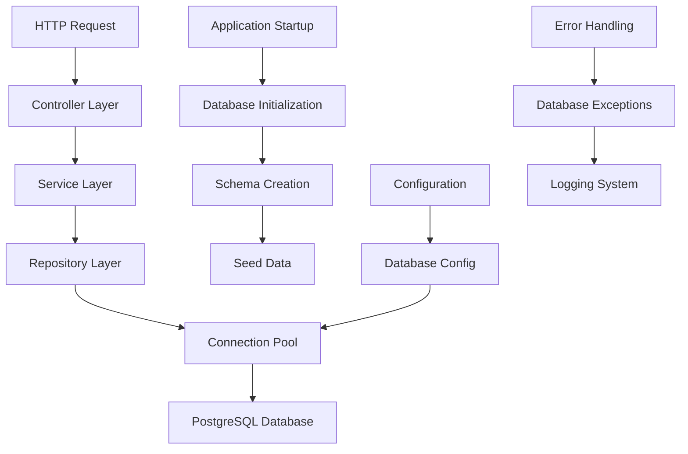
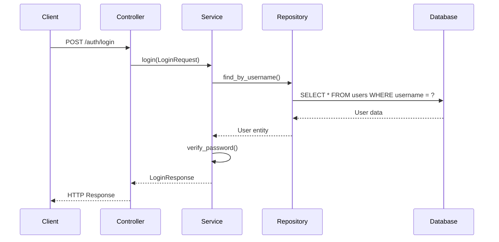

# Design Document

## Overview

本设计文档描述了在Hyperlane Rust框架中集成PostgreSQL数据库支持的技术架构。该设计遵循项目现有的模块化架构和文件命名规范，使用Rust关键字作为文件名，并确保与现有框架的无缝集成。

系统采用分层架构设计，包括配置层、数据访问层、业务逻辑层和控制器层，通过依赖注入和连接池管理实现高性能的数据库操作。

## Architecture

### 系统架构图



### 模块组织结构

```
config/framework/
├── database/
│   ├── struct.rs          # DatabaseConfig结构体定义
│   ├── impl.rs            # 配置实现和默认值
│   └── mod.rs             # 模块导出

init/framework/
├── database/
│   ├── struct.rs          # 初始化结构体定义
│   ├── impl.rs            # 数据库初始化逻辑
│   ├── fn.rs              # 初始化函数
│   └── mod.rs             # 模块导出

app/model/persistent/
├── user/
│   ├── struct.rs          # User实体结构体
│   ├── impl.rs            # 实体方法实现
│   └── mod.rs             # 模块导出

app/model/data_access/
├── user_repository/
│   ├── struct.rs          # Repository结构体
│   ├── impl.rs            # 数据库操作实现
│   └── mod.rs             # 模块导出

app/service/auth/
├── struct.rs              # AuthService结构体
├── impl.rs                # 认证业务逻辑
└── mod.rs                 # 模块导出

app/controller/auth/
├── struct.rs              # 控制器结构体
├── impl.rs                # HTTP处理逻辑
└── mod.rs                 # 模块导出

app/exception/database/
├── enum.rs                # 数据库错误枚举
├── impl.rs                # 错误处理实现
└── mod.rs                 # 模块导出
```

## Components and Interfaces

### 1. 数据库配置组件 (config/framework/database/)

**DatabaseConfig结构体**
```rust
pub struct DatabaseConfig {
    pub host: String,
    pub port: u16,
    pub database: String,
    pub username: String,
    pub password: String,
    pub max_connections: u32,
    pub min_connections: u32,
    pub connection_timeout: Duration,
    pub idle_timeout: Duration,
}
```

**主要接口**
- `new()` - 创建默认配置
- `from_env()` - 从环境变量加载配置
- `validate()` - 验证配置有效性

### 2. 连接池管理组件

**ConnectionPool结构体**
```rust
pub struct ConnectionPool {
    pool: bb8::Pool<bb8_postgres::PostgresConnectionManager<tokio_postgres::NoTls>>,
}
```

**主要接口**
- `new(config: DatabaseConfig)` - 创建连接池
- `get_connection()` - 获取数据库连接
- `health_check()` - 健康检查
- `get_stats()` - 获取连接池统计信息

### 3. 用户实体模型 (app/model/persistent/user/)

**User结构体**
```rust
pub struct User {
    pub id: uuid::Uuid,
    pub username: String,
    pub password_hash: String,
    pub created_at: chrono::DateTime<chrono::Utc>,
    pub updated_at: chrono::DateTime<chrono::Utc>,
}
```

**数据传输对象**
```rust
pub struct LoginRequest {
    pub username: String,
    pub password: String,
}

pub struct LoginResponse {
    pub success: bool,
    pub message: String,
    pub user_id: Option<uuid::Uuid>,
}
```

### 4. 数据访问层 (app/model/data_access/user_repository/)

**UserRepository Trait**
```rust
#[async_trait]
pub trait UserRepository {
    async fn find_by_username(&self, username: &str) -> Result<Option<User>, DatabaseError>;
    async fn create_user(&self, user: &User) -> Result<(), DatabaseError>;
    async fn verify_password(&self, username: &str, password: &str) -> Result<bool, DatabaseError>;
}
```

### 5. 认证服务 (app/service/auth/)

**AuthService结构体**
```rust
pub struct AuthService {
    user_repository: Arc<dyn UserRepository>,
}
```

**主要接口**
- `login(request: LoginRequest)` - 用户登录
- `hash_password(password: &str)` - 密码哈希
- `verify_password(password: &str, hash: &str)` - 密码验证

### 6. 认证控制器 (app/controller/auth/)

**AuthController结构体**
```rust
pub struct AuthController {
    auth_service: Arc<AuthService>,
}
```

**HTTP端点**
- `POST /auth/login` - 用户登录接口

## Data Models

### 数据库Schema设计

**用户表 (users)**
```sql
CREATE TABLE IF NOT EXISTS users (
    id UUID PRIMARY KEY DEFAULT gen_random_uuid(),
    username VARCHAR(255) UNIQUE NOT NULL,
    password_hash VARCHAR(255) NOT NULL,
    created_at TIMESTAMP WITH TIME ZONE DEFAULT NOW(),
    updated_at TIMESTAMP WITH TIME ZONE DEFAULT NOW()
);

CREATE INDEX IF NOT EXISTS idx_users_username ON users(username);
```

### 数据流设计



## Error Handling

### 错误类型定义 (app/exception/database/)

```rust
#[derive(Debug, thiserror::Error)]
pub enum DatabaseError {
    #[error("Connection failed: {0}")]
    ConnectionFailed(String),
    
    #[error("Query execution failed: {0}")]
    QueryFailed(String),
    
    #[error("User not found")]
    UserNotFound,
    
    #[error("Authentication failed")]
    AuthenticationFailed,
    
    #[error("Database initialization failed: {0}")]
    InitializationFailed(String),
}
```

### 错误处理策略

1. **连接错误** - 自动重试机制，记录详细日志
2. **查询错误** - 事务回滚，返回用户友好错误信息
3. **认证错误** - 安全日志记录，防止信息泄露
4. **初始化错误** - 应用启动失败，提供诊断信息

## Testing Strategy

### 单元测试

1. **配置模块测试**
   - 默认配置验证
   - 环境变量加载测试
   - 配置验证逻辑测试

2. **数据访问层测试**
   - Mock数据库连接测试
   - SQL查询逻辑验证
   - 错误处理测试

3. **业务逻辑测试**
   - 密码哈希和验证测试
   - 用户认证流程测试
   - 边界条件测试

### 集成测试

1. **数据库连接测试**
   - 连接池创建和管理
   - 连接健康检查
   - 并发连接测试

2. **端到端测试**
   - 完整登录流程测试
   - 数据库初始化测试
   - 错误场景测试

### 性能测试

1. **连接池性能**
   - 并发连接获取测试
   - 连接复用效率测试
   - 内存使用监控

2. **查询性能**
   - 用户查询响应时间
   - 批量操作性能
   - 索引效果验证

## Security Considerations

### 密码安全

1. **密码哈希** - 使用bcrypt算法，成本因子12
2. **盐值管理** - 每个密码使用唯一盐值
3. **时间攻击防护** - 恒定时间比较

### 数据库安全

1. **连接加密** - 生产环境使用TLS连接
2. **权限控制** - 最小权限原则
3. **SQL注入防护** - 参数化查询

### 日志安全

1. **敏感信息过滤** - 不记录密码等敏感数据
2. **访问日志** - 记录认证尝试和结果
3. **错误日志** - 详细记录但不暴露内部信息